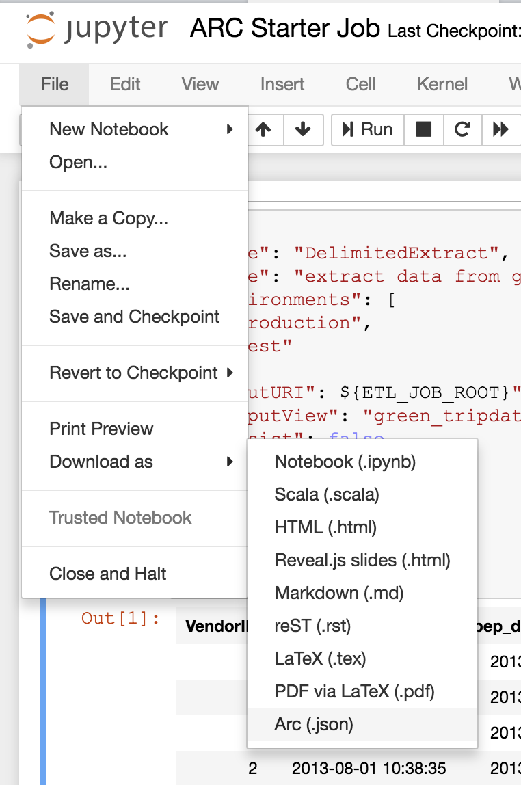
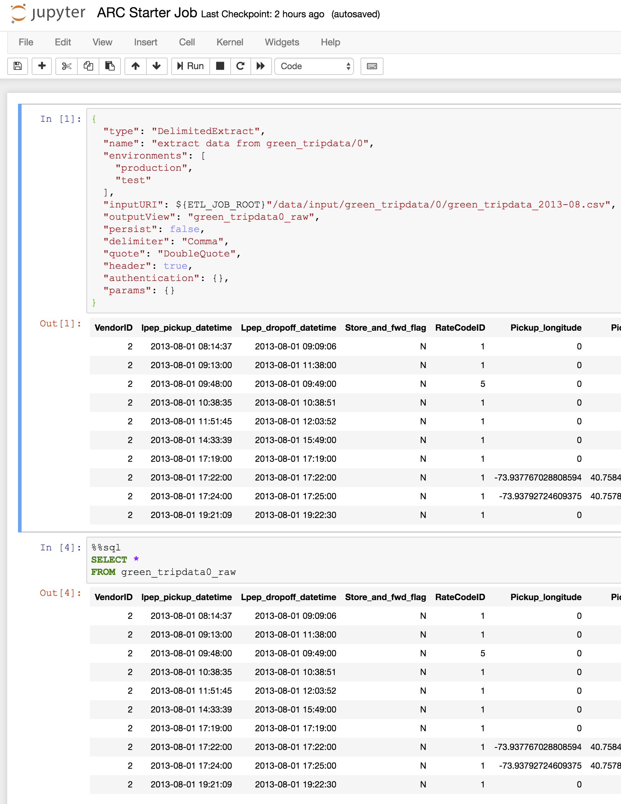

# Arc Starter

A starter project to begin coding an [Arc](https://github.com/aglenergy/arc) job using the Jupyter Notebook interface.

## Running

Clone this repository then run the included shells script. The user interface will then be available at http://localhost:8888 and the token will be printed to the console.

```bash
./.develop.sh
```

The `.develop.sh` script contains a hard coded memory allocation for [Apache Spark](https://spark.apache.org/) via the Java Virtual Machine which should be configured for your specific environment. e.g. to change from 4 Gigabytes to 8 Gigabytes:

```bash
-e JAVA_OPTS="-Xmx4g" \
```

to 

```bash
-e JAVA_OPTS="-Xmx8g" \
```

**Important:**

If you are running [Docker For Mac](https://docs.docker.com/docker-for-mac/) or [Docker for Windows](https://docs.docker.com/docker-for-windows/) ensure that the Docker memory allocation is large enough to support the memory `-Xmx4g` requested:


## How to execute

By default everything will be executed as an Arc stage.

If needed SQL can be executed directly by using the Jupyter `%sql` magic which can speed development 

```sql
%sql limit=10 truncate=100 outputView=green_tripdata0
SELECT * 
FROM green_tripdata0_raw
WHERE fare_amount < 10
```

- `limit` specifies number of rows to return
- `truncate` specifies the maximum length of any printed strings
- `outputView` allows registration of a Spark view so it can be referenced in later stages.

Two other 'magics' have been defined:

- `%env` which allows setting job variables via the notebook (e.g. `%env ETL_CONF_KEY0=value0 ETL_CONF_KEY1=value1`)
- `%schema` which will print the Spark schema of a view.
- `%printschema` which will print the Spark schema in a simple text mode.
- `%metadata` which will try to create and print the correct Arc metadata file for the supplied view.

## Exporting

To export an Arc job an option has been provided in the `File\Download as` menu which will export all the Arc stages from the notebook and create a job file. Note that Jupyter Notebooks has been modified so that the `.ipynb` file will not save any `output` datasets to prevent data from being accidentally committed to version control.



## Screenshot


